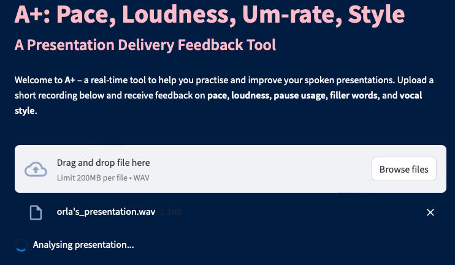
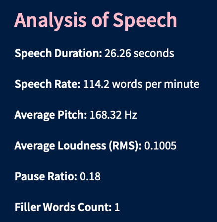
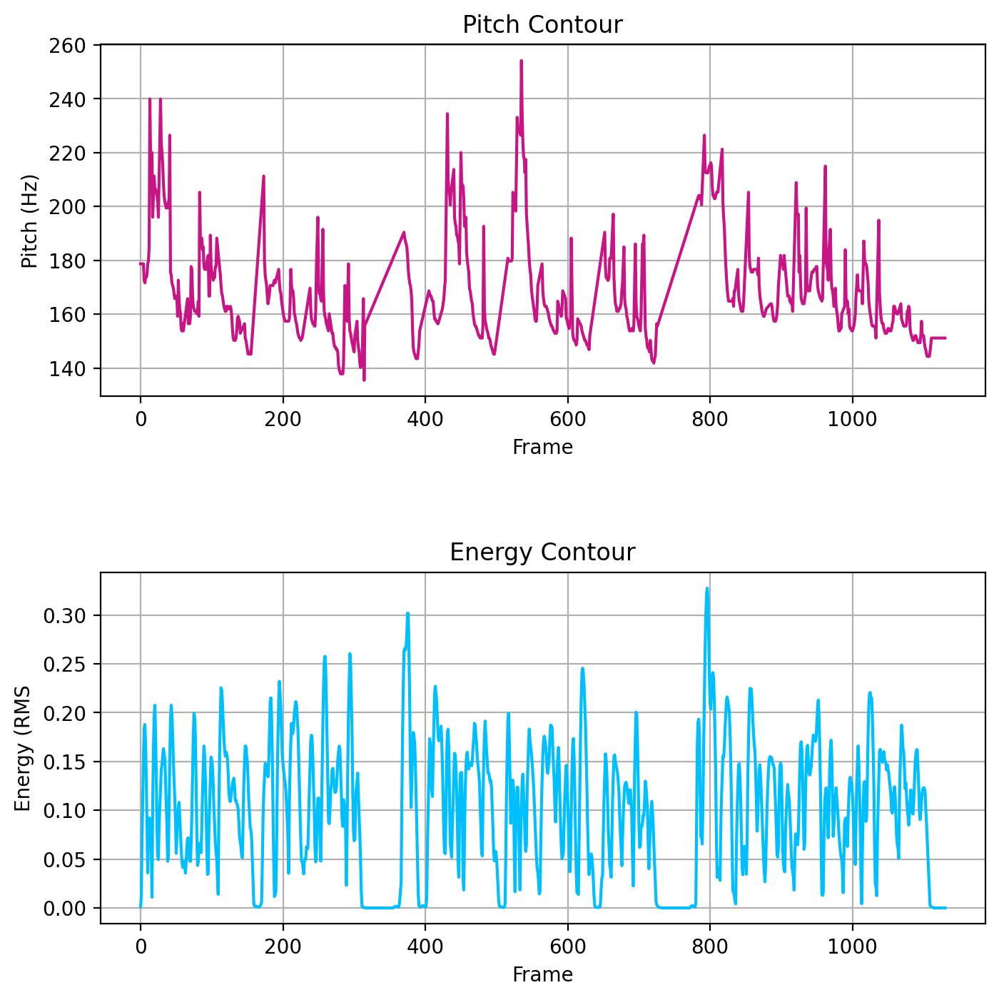

  

## A+: A Presentation Feedback Tool

This project is a prototype Presentation Delivery Feedback Tool developed for **COMP47700**.  
It is designed to assist university students in practising and improving their spoken communication skills by providing automated feedback on presentation delivery.

---

  

The tool analyses a short audio recording of the user reading a presentation-style passage and provides objective feedback on key delivery metrics including:

- Speech Rate (Words Per Minute)
- Vocal Inflection (Pitch Variation)
- Vocal Energy (Volume/Projection)
- Pause Usage (Timing and Frequency)
- Filler Words (e.g., "um", "eh")

By offering structured and actionable feedback, this tool aims to help students deliver clearer, more confident, and more engaging presentations.

---

## Overview of Features

- Audio feature extraction using:
  - `librosa` for pitch and energy analysis
  - `pydub` for pause detection
  - `speech_recognition` for transcription and WPM calculation
- Automatic detection of filler words
- Rule-based evaluation logic grounded in public speaking literature
- Visualisation of key metrics (e.g., pitch contour, pause distribution)
- Simple, user-friendly web interface built with Streamlit

---

## Typical Workflow

1. User uploads an audio sample of a presentation.
2. The tool processes the audio, extracts relevant features, and generates a transcript.
3. Heuristics evaluate the delivery and produce targeted feedback.
4. Users receive visual and textual summaries, including suggestions for improvement.
5. Users may re-record and re-upload the passage to assess progress over time.

---

## Technical Summary

- **Speech Rate**: Calculated by dividing transcript word count by duration.
- **Pitch**: Extracted using `librosa.pyin` and analysed for range and variation.
- **Energy**: Measured using RMS (Root Mean Square) loudness.
- **Pauses**: Detected using energy thresholds.
- **Filler Words**: Identified via keyword scanning in the transcript.

---

## Example Outputs

  

---

  

---

  

---

## Educational Value

This tool enables users to:

- Develop greater self-awareness regarding speech delivery
- Practise critical aspects of public speaking independently
- Receive consistent, evidence-based feedback
- Monitor improvement through repeated trials

---

## Technologies Used

- Python
- Streamlit
- Librosa
- Pydub
- SpeechRecognition
- Matplotlib

---

## Evaluation Method

The tool’s impact is assessed through a before-and-after test:

- Users record a first attempt and receive feedback.
- They re-record after reviewing suggestions.
- Changes in metrics (pitch variation, speech rate, loudness) are compared to assess improvement.

---

## References

- [Presenting With Confidence (PMC)](https://pmc.ncbi.nlm.nih.gov/articles/PMC6505544/)
- [Effects of Speaking Rate on Speech and Silent Speech Recognition (ACM)](https://dl.acm.org/doi/fullHtml/10.1145/3491101.3519611)
- [Exploring Feedback Strategies for Public Speaking (ResearchGate)](https://www.researchgate.net/publication/292148167)
- [Lawrence Bernstein: The Trick to Powerful Public Speaking (TED Talk)](https://www.ted.com/talks/lawrence_bernstein_the_trick_to_powerful_public_speaking?language=en)
- [Narakeet: Create Text-to-Speech WAV Files](https://www.narakeet.com/create/text-to-wav.html)

---

## Acknowledgements

This project was created as part of the **COMP47700: Speech and Audio Processing** module at University College Dublin.  
Special thanks to contributors for their voice samples and to academic supervisors for their guidance.

---

## Future Work

- Support for longer presentations
- Live recording and playback functionality
- Machine learning-based personalised feedback
